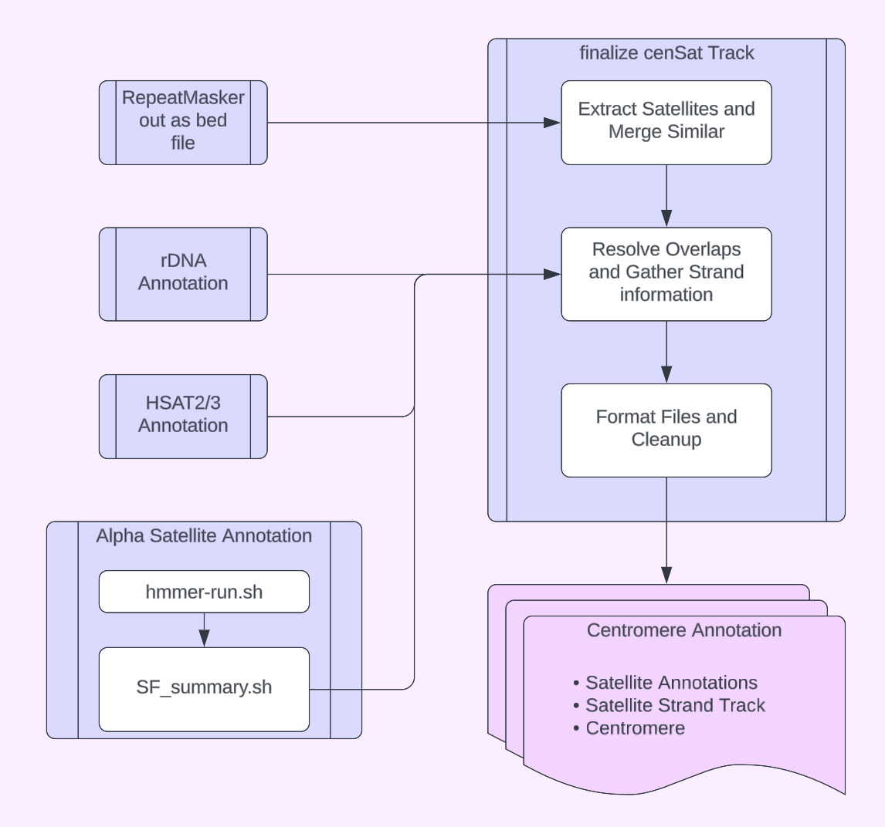

## Primate Satellite Annotations 

Satellite Annotations generated by Hailey Loucks 
Please contact with questions at hloucks@ucsc.edu

### Process overview 

### Overview of types of Annotations 

#### Alpha Satellite 
- "active_hor(SFx)" - active HOR array, identified as longest HOR array on chromosome as of version 0.1
- "hor(SFx)" or "mon/hor(SFx)" - HOR repeats, summarized from superfamily annotations SF1-6
- "dhor(SF0x)" - divered HOR repeats of superfamilies 01 and 02
- "mon" - other superfamilies SF7+ 
- "mixedAlpha(SFx, SFy) - regions that can't clearly be resolved as one SF 

#### Other Satellite Annotations
- "hsat1A" - RepeatMasker SAR annotation 
- "hsat1B - RepeatMasker HSATI annotation 
- "gsat(gsattype)" - RepeatMasker GSat Annotations 
- "HSat2" - Annotated with Nick Altemose' perl script [here](https://github.com/altemose/chm13_hsat)
- "HSat3" - Annotated with Nick Altemose' perl script [here](https://github.com/altemose/chm13_hsat)

#### Composite Satellite Annotations 
- "bSat(monomerTypes)" - RepeatMasker annotations, monomers include BSR, BSAT, LSAU
- "cenSat(monomerTypes)" - RepeatMasker annotations - other satellites enriched in centromere, includes CER, SATR, SST1, ACRO, HSAT4/5, and TAF11
- "subTerm(monomerTypes)" - Sub terminal satellite repeats - non human primate specific. Monomers are species specific but include PtpCHT7 and StSat_pCHT_v6_Pp

#### Other Annotations 
- "ct" - Centromere transition region, see schema below for definition
- "GAP" - regions of N's annotated using Seqtk gap 
- "rDNA" - rDNA annotated with annotation workflow [here](https://github.com/kmiga/alphaAnnotation/blob/main/cenSatAnnotation/tasks/rDNA_annotation.wdl)

### Censat v0.1 Release 5/6/24

First draft primate censat annotations for *Pan troglodytes*, *Pan paniscus*, and *Gorilla gorilla*
Please document any issues you find in [this document](https://docs.google.com/spreadsheets/d/1UVqb11FiSKcm3jpo81KQGn1jd74TxLODyUpQr-bNBhk/edit?usp=sharing) 

Note - Versions 0.1 may have some overlaps in some of the smaller satellite annotations, alpha satellite annotations should have all overlaps resolved. 
